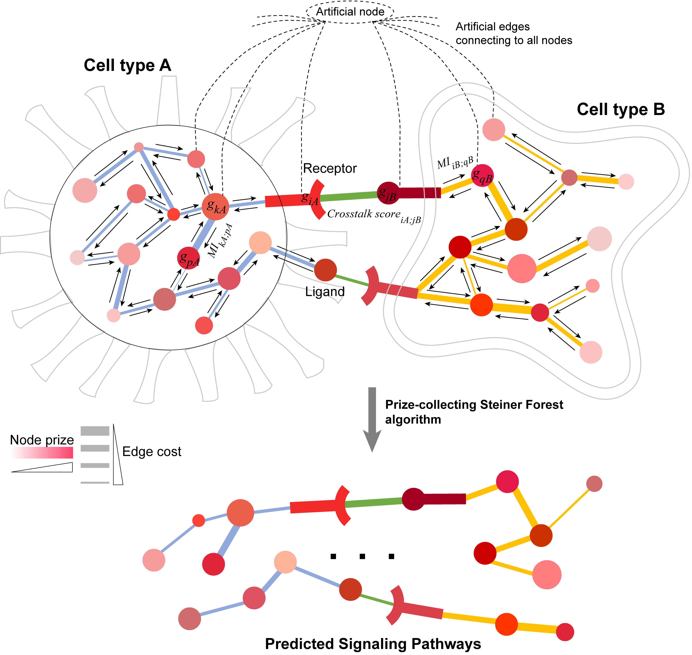

<!-- README.md is generated from README.Rmd. Please edit that file -->

# CytoTalk

<!-- badges: start -->
<!-- badges: end -->

<div align="center">


</div>

## Table of Contents

-   [CytoTalk](#cytotalk)
    -   [Table of Contents](#table-of-contents)
    -   [Overview](#overview)
        -   [Background](#background)
    -   [Getting Started](#getting-started)
        -   [Prerequisites](#prerequisites)
        -   [Installation](#installation)
        -   [Preparation](#preparation)
        -   [Running CytoTalk](#running-cytotalk)
    -   [Update Log](#update-log)
    -   [Citing CytoTalk](#citing-cytotalk)
    -   [References](#references)
    -   [Contact](#contact)

## Overview

We have developed the CytoTalk algorithm for *de novo* construction of a
signaling network between two cell types using single-cell
transcriptomics data. This signaling network is the union of multiple
signaling pathways originating at ligand-receptor pairs. Our algorithm
constructs an integrated network of intracellular and intercellular
functional gene interactions. A prize-collecting Steiner tree (PCST)
algorithm is used to extract the signaling network, based on node prize
(cell-specific gene activity) and edge cost (functional interaction
between two genes). The objective of the PCSF problem is to find an
optimal subnetwork in the integrated network that includes genes with
high levels of cell-type-specific expression and close connection to
highly active ligand-receptor pairs.

### Background

Signal transduction is the primary mechanism for cell-cell communication
and scRNA-seq technology holds great promise for studying this
communication at high levels of resolution. Signaling pathways are
highly dynamic and cross-talk among them is prevalent. Due to these two
features, simply examining expression levels of ligand and receptor
genes cannot reliably capture the overall activities of signaling
pathways and the interactions among them.

## Getting Started


### Installation

(1) Install [Conda](https://docs.conda.io/projects/conda/en/latest/user-guide/install/index.html)
at the very beginning for all of Windows, Linux and macOS users.

!!! For Windows users, please additionally install [Microsoft Visual C++ Build
Tools](https://visualstudio.microsoft.com/visual-cpp-build-tools/) and
[Rtools
4.0](https://cran.r-project.org/bin/windows/Rtools/rtools40.html).

(2) Install a python module 
[`pcst_fast`](https://github.com/fraenkel-lab/pcst_fast) by running the commands below in the *R* (>= v4.1.3) console.

``` r
if (!requireNamespace("reticulate", quietly = TRUE)) {
  install.packages("reticulate")
}
reticulate::conda_create(envname = "CytoTalk_PCSF", "python=3.10")  # Create a new Conda environment to facilitate the Python module installation. python=3.10 is compatible with numpy=1.26
reticulate::conda_install(envname = "CytoTalk_PCSF", "pybind11")  # Install two necessary Python modules for correctly compiling and using the "pcst_fast" Python module.
reticulate::conda_install(envname = "CytoTalk_PCSF", "numpy=1.26")  # Avoid using numpy>=2.0, which is not compatible with the python module "pcst_fast".
reticulate::conda_install(envname = "CytoTalk_PCSF", "git+https://github.com/fraenkel-lab/pcst_fast.git", pip = TRUE) # To install the "pcst_fast" module.
```

(3) Install the CytoTalk package in the *R* console.

``` r
if (!requireNamespace("devtools", quietly = TRUE)) {
  install.packages("devtools")
}
options(timeout = 600)  # Giving more time for downloading.
devtools::install_github("huBioinfo/CytoTalk")
```

### Preparation

Let’s assume we have an input folder called “ExampleInput”, filled with
a single-cell RNA sequencing dataset. Here’s an example directory
structure:

``` txt
── ExampleInput
   ├─ scRNAseq_BasalCells.csv
   ├─ scRNAseq_EndothelialCells.csv
   ├─ scRNAseq_Fibroblasts.csv
   ├─ scRNAseq_LuminalEpithelialCells.csv
   └─ scRNAseq_Macrophages.csv
```

<br />

⚠ **IMPORTANT** ⚠

Notice all of these files have the prefix “scRNAseq\_” and the extension
“.csv”; CytoTalk looks for files matching this pattern, so be sure to
replicate it with your filenames. Let’s try reading in the folder:

``` r
# read in data folder
dir_in <- "./ExampleInput"
lst_scrna <- CytoTalk::read_matrix_folder(dir_in)
table(lst_scrna$cell_types)
```

``` console
            BasalCells       EndothelialCells            Fibroblasts LuminalEpithelialCells            Macrophages 
                   392                    251                    700                    459                    186 
```

The outputted names are all the cell types we can choose to run CytoTalk
against. 


### Running CytoTalk

``` r
# set required parameters
type_a <- "Fibroblasts"
type_b <- "LuminalEpithelialCells"

# run CytoTalk process
reticulate::use_condaenv("CytoTalk_PCSF", required = TRUE) #Use a specific conda environment that contains the "pcst_fast" python module.
results <- CytoTalk::run_cytotalk(lst_scrna, type_a, type_b, pcg = CytoTalk::pcg_mouse, lrp = CytoTalk::lrp_mouse, dir_out = "./Output")
```

``` console
[1 / 8] (11:15:28) Preprocessing...
[2 / 8] (11:16:13) Mutual information matrix...
[3 / 8] (11:20:19) Indirect edge-filtered network...
[4 / 8] (11:20:37) Integrate network...
[5 / 8] (11:21:44) PCSF...
[6 / 8] (11:21:56) Determine best signaling network...
[7 / 8] (11:21:58) Generate network output...
[8 / 8] (11:21:59) Analyze pathways...
```

All we need for a default run is the named list and selected cell types
(“Macrophages” and “LuminalEpithelialCells”). The most important
optional parameters to look at are `cutoff_a`, `cutoff_b`, and
`beta_max`; details on these can be found in the help page for the
`run_cytotalk` function (see `?run_cytotalk`). As the process runs, we
see messages print to the console for each sub process.

Here is what the structure of the output list looks like (abbreviated):

``` r
str(results)
```

``` console
List of 5
 $ params
 $ pem
 $ integrated_net
  ..$ nodes
  ..$ edges
 $ pcst
  ..$ occurances
  ..$ ks_test_pval
  ..$ final_network
 $ pathways
  ..$ raw
  ..$ graphs
  ..$ df_pval
```

In the order of increasing effort, let’s take a look at some of the
results. Let’s begin with the `results$pathways` item. This list item
contains `DiagrammeR` graphs, which are viewable in RStudio, or can be
exported if the `dir_out` parameter is specified during execution. Here
is an example pathway neighborhood:

<div align="center">


</div>

Note that the exported SVG files (see `dir_out` parameter) are
interactive, with hyperlinks to GeneCards and WikiPI. Green edges are
directed from ligand to receptor. Additionally, if we specify an output
directory, we can see a “cytoscape” sub-folder, which includes a SIF
file read to import and two tables that can be attached to the network
and used for styling. Here’s an example of a styled Cytoscape network:

<div align="center">


</div>

<br />

There are a number of details we can glean from these graphs, such as
node prize (side of each node), edge cost (inverse edge width),
Preferential Expression Measure (intensity of each color), cell type
(based on color, and shape in the Cytoscape output), and interaction
type (dashed lines for crosstalk, solid for intracellular).

If we want to be more formal with the pathway analysis, we can look at
some scores for each neighborhood in the `results$pathways$raw` item.
This list provides extracted subnetworks, based on the final network
from the PCST. Additionally, the `results$pathways$df_pval` item
contains a summary of the neighborhood size for each pathway, along with
theoretical (Gamma distribution) test values that are found by
contrsting the found pathway to random pathways from the integrated
network.
-values
for node prize, edge cost, and potential are calculated separately.

## Update Log

2025-12-14:We referred to CellChat's ligand-receptor database and reorganized the lrp data file for CytoTalk. Currently, lrp_human contains 3036 rows of ligand data, while lrp_house contains 3265 rows of ligand data. In addition, we have added the use_cache parameter to the main function "run_cytotalk", where TRUE is enabled and False is disabled. The purpose is to save the most time-consuming intermediate results in the calculation process to a local file, so that when the same parameter/cell type combination is repeatedly run in the future, the cache file can be directly loaded to skip the repeated calculation, which is convenient for debugging and reduces time waste. (Updated by Dongxu Yu)

2025-11-9:We have expanded the pairings of human and mouse pre-existing ligands and receptors to facilitate a better search for pathways. (Updated by Dongxu Yu)

2025-10-13:We have made improvements to CytoTalk, fixing four types of potential errors in this update. These include: replacing mutual information values of ≤0 with 1e-5 in the calculation of nonselftalk scores to avoid infinite values generated by subsequent -log10 operations; eliminating independent genes with mutual information values of 0 to resolve the NaN error caused by a denominator of 0 in the calculation of gene correlation coefficients during random walk; adding conditional checks when selecting single genes to fix errors caused by parameter anomalies in the addnoise code; optimizing the PEM normalization logic to skip minmax normalization when only one edge exists, thus avoiding subsequent code errors caused by missing values (NA); and adjusting the c-t edge style from dashed to solid lines to enhance the visibility of key edges in the pathway diagram. (Updated by Dongxu Yu)

2022-05-05: We have updated the installation and usage of the
[`pcst_fast` module](https://github.com/fraenkel-lab/pcst_fast) for
running the CytoTalk package completely in the *R* console as a new
under-development branch “feature_RcallPy”, which has been tested on
both Windows and macOS.

2021-11-30: The latest release “CytoTalk_v0.99.0” resets the versioning
numbers in anticipation for submission to Bioconductor. This newest
version packages functions in a modular fashion, offering more flexible
input, usage, and output of the CytoTalk subroutines.

2021-10-07: The release “CytoTalk_v4.0.0” is a completely re-written R
version of the program. Approximately half of the run time as been
shaved off, the program is now cross-compatible with Windows and \*NIX
systems, the file space usage is down to roughly a tenth of what it was,
and graphical outputs have been made easier to import or now produce
portable SVG files with embedded hyperlinks.

2021-06-08: The release “CytoTalk_v3.1.0” is a major updated R version
on the basis of v3.0.3. We have added a function to generate Cytoscape
files for visualization of each ligand-receptor-associated pathway
extracted from the predicted signaling network between the two given
cell types. For each predicted ligand-receptor pair, its associated
pathway is defined as the user-specified order of the neighborhood of
the ligand and receptor in the two cell types.

2021-05-31: The release “CytoTalk_v3.0.3” is a revised R version on the
basis of v3.0.2. A bug has been fixed in this version to avoid errors
occurred in some special cases. We also provided a new example
“RunCytoTalk_Example_StepByStep.R” to run the CytoTalk algorithm in a
step-by-step fashion. Please download “CytoTalk_package_v3.0.3.zip” from
the Releases page
(<https://github.com/huBioinfo/CytoTalk/releases/tag/v3.0.3>) and refer
to the user manual inside the package.

2021-05-19: The release “CytoTalk_v3.0.2” is a revised R version on the
basis of v3.0.1. A bug has been fixed in this version to avoid running
errors in some extreme cases. Final prediction results will be the same
as v3.0.1. Please download the package from the Releases page
(<https://github.com/huBioinfo/CytoTalk/releases/tag/v3.0.2>) and refer
to the user manual inside the package.

2021-05-12: The release “CytoTalk_v3.0.1” is an R version, which is more
easily and friendly to use!! Please download the package from the
Releases page
(<https://github.com/huBioinfo/CytoTalk/releases/tag/v3.0.1>) and refer
to the user manual inside the package.

## Citing CytoTalk

-   Hu Y, Peng T, Gao L, Tan K. CytoTalk: *De novo* construction of
    signal transduction networks using single-cell transcriptomic data.
    ***Science Advances***, 2021, 7(16): eabf1356.

    <https://advances.sciencemag.org/content/7/16/eabf1356>

## References

-   Shannon P, et al. Cytoscape: a software environment for integrated
    models of biomolecular interaction networks. *Genome Research*,
    2003, 13: 2498-2504.

## Contact

Kai Tan, <tank1@chop.edu>

Yuxuan Hu, <huyuxuan@xidian.edu.cn>

<br />
